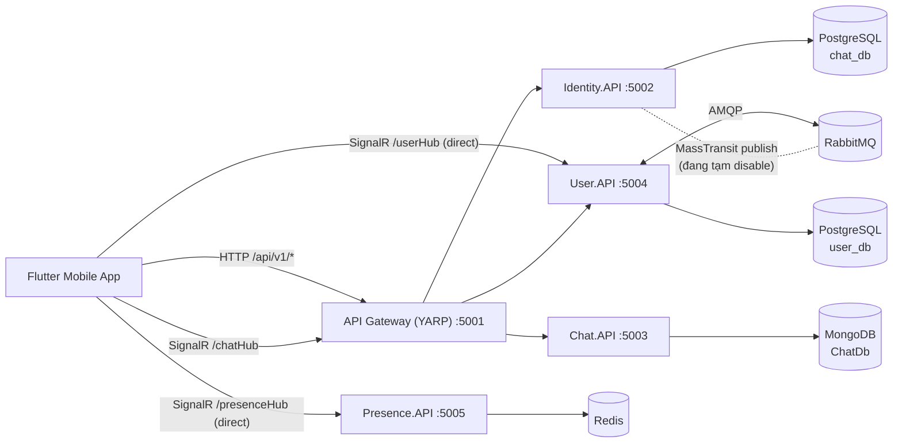
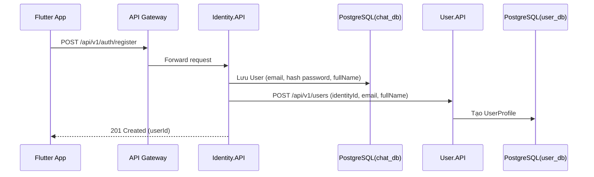
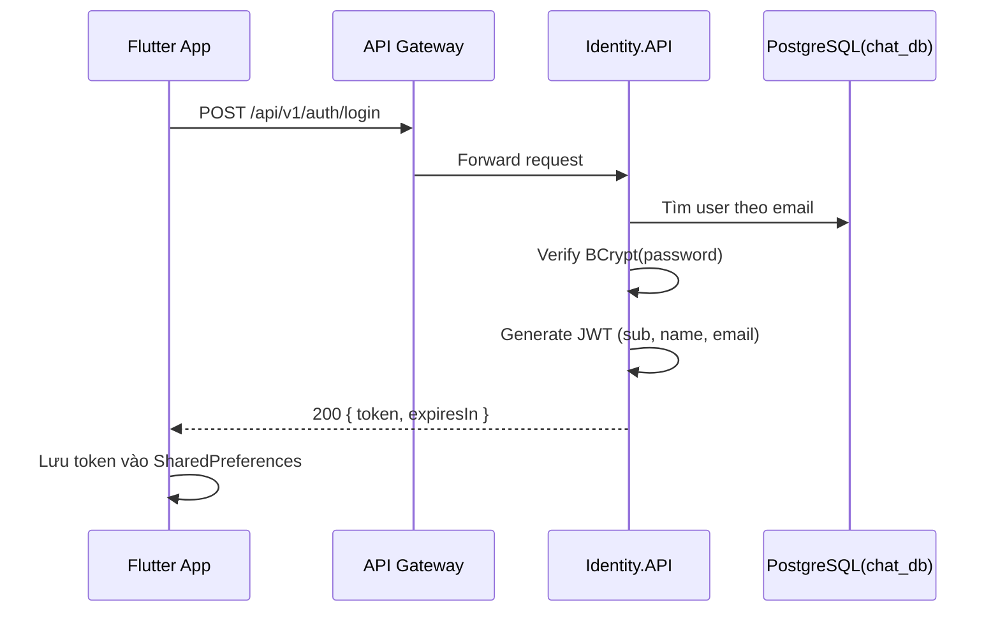
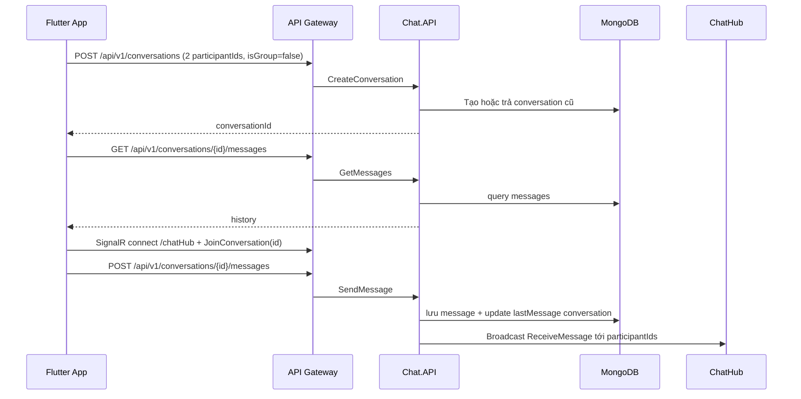
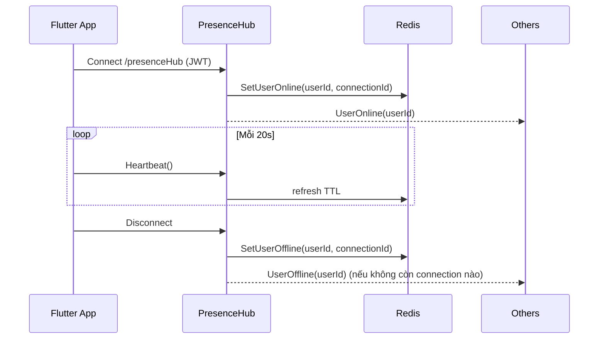

# AppChat: Kiến trúc sạch và luồng dữ liệu (VI)

## 1. Tổng quan hệ thống

AppChat gồm 2 khối chính:

1. Mobile app Flutter (UI + state bằng `provider`) tại:
`/Volumes/DVM/appchat/mobile/lib`
2. Backend microservices .NET 8 tại:
`/Volumes/DVM/appchat/backend/src`

Các service backend chính:

1. `Identity.API`: đăng ký, đăng nhập, phát JWT
2. `User.API`: hồ sơ người dùng, quan hệ bạn bè, upload avatar, `UserHub`
3. `Chat.API`: hội thoại, tin nhắn, phản ứng, nhóm, `ChatHub`
4. `Presence.API`: trạng thái online/offline, `PresenceHub`
5. `ApiGateway` (YARP): định tuyến API/Hub qua cổng gateway

Hạ tầng runtime qua Docker Compose:

1. PostgreSQL (Identity/User)
2. MongoDB (Chat)
3. Redis (Presence)
4. RabbitMQ (Event bus, hiện User dùng, Identity đang tạm tắt publish)
5. MinIO, Seq

---

## 2. Sơ đồ kiến trúc tổng thể

---

## 3. Sơ đồ lớp logic (Clean-ish layering)

Mỗi service tách theo lớp:

1. `*.API`: Controller/Hub/Program
2. `*.Application`: Command/Query + Handler (MediatR)
3. `*.Domain`: Entity, enum, interface nghiệp vụ
4. `*.Infrastructure`: Repository, DbContext, external integration

Shared building blocks:

1. `BuildingBlocks.Core`
2. `BuildingBlocks.CQRS`
3. `BuildingBlocks.EventBus`

---

## 4. Luồng dữ liệu chi tiết

## 4.1. Đăng ký (Register)

Điểm quan trọng:

1. Identity hash mật khẩu bằng BCrypt.
2. Sau khi tạo user identity, Identity gọi HTTP sang User service để tạo profile.
3. Cơ chế event bus cho Identity đang comment tạm thời trong `Program.cs`.

---

## 4.2. Đăng nhập (Login)

---

## 4.3. Bạn bè (Search/Add/Accept/Decline)

### Tìm user theo email

1. App gọi `GET /api/v1/users/email/{email}` (có Bearer token).
2. User service trả profile + `friendshipStatus` theo requester.

### Gửi lời mời

1. App gọi `POST /api/v1/friends/request`.
2. User service map `sub` (IdentityId) -> UserProfile.Id.
3. Tạo `Friendship` trạng thái `Pending`.
4. User service bắn SignalR `FriendRequestReceived` tới `UserHub` group của người nhận.

### Chấp nhận/Từ chối

1. `POST /api/v1/friends/accept` hoặc `POST /api/v1/friends/decline`.
2. Khi accept, trạng thái chuyển `Accepted` và bắn `FriendRequestAccepted` qua `UserHub`.

---

## 4.4. Chat 1-1

Điểm quan trọng:

1. Message endpoint có `[Authorize]`, senderId bị override từ token để tránh spoofing.
2. Đọc tin nhắn dùng Hub method `MarkAsRead`, backend cập nhật `ReadBy` và bắn `MessagesRead`.

---

## 4.5. Chat nhóm (Group)

Tính năng chính:

1. Tạo nhóm (`isGroup=true`, có `creatorId`, có `inviteToken`)
2. Thêm/xóa thành viên (chỉ creator)
3. Join bằng invite token
4. Rời nhóm (creator không rời, phải disband)
5. Cập nhật tên/mô tả/ảnh nhóm
6. Giải tán nhóm

Realtime event liên quan:

1. `ConversationCreated`
2. `ConversationUpdated`
3. `ConversationDeleted`
4. `ReceiveMessage` (bao gồm system message của nhóm)

---

## 4.6. Presence (Online/Offline)

Điểm quan trọng:

1. Redis lưu cả trạng thái presence và tập connection theo user.
2. Chỉ phát `UserOffline` khi user thật sự không còn connection nào.
3. Flutter có fallback polling để giảm miss event khi reconnect.

---

## 5. Kết nối từ Flutter tới backend

HTTP:

1. Qua gateway `:5001` cho auth/user/chat API.
2. Riêng presence HTTP đọc trạng thái dùng `:5005` (direct).

SignalR:

1. `chatHub`: qua gateway `:5001/chatHub`
2. `userHub`: direct `:5004/userHub`
3. `presenceHub`: direct `:5005/presenceHub`

---

## 6. Trạng thái hiện tại và lưu ý kỹ thuật

1. Identity chưa bật MassTransit publish event (đang dùng HTTP sang User service để tạo profile).
2. `ConversationsController` chưa gắn `[Authorize]`, trong khi `MessagesController` đã `[Authorize]`.
3. Secret JWT đang hardcoded/default ở vài nơi; nên chuẩn hóa qua cấu hình môi trường.
4. Một số endpoint/hub đi direct thay vì qua gateway, cần thống nhất nếu muốn 1 điểm vào duy nhất.

---

## 7. Danh sách endpoint/hub chính (runtime)

1. Auth:
`POST /api/v1/auth/register`
`POST /api/v1/auth/login`
2. Users:
`GET /api/v1/users/identity/{identityId}`
`GET /api/v1/users/email/{email}`
`PUT /api/v1/users/profile`
3. Friends:
`POST /api/v1/friends/request`
`POST /api/v1/friends/accept`
`POST /api/v1/friends/decline`
`GET /api/v1/friends`
`GET /api/v1/friends/pending`
4. Chat:
`POST /api/v1/conversations`
`GET /api/v1/conversations`
`POST /api/v1/conversations/{id}/messages`
`GET /api/v1/conversations/{id}/messages`
`POST /api/v1/conversations/{id}/participants`
`DELETE /api/v1/conversations/{id}/participants/{participantId}`
`POST /api/v1/conversations/join`
`POST /api/v1/conversations/{id}/leave`
`PUT /api/v1/conversations/{id}`
`DELETE /api/v1/conversations/{id}`
5. Presence:
`GET /api/v1/presence/{userId}`
`POST /api/v1/presence/batch`
6. SignalR Hubs:
`/chatHub`
`/userHub`
`/presenceHub`
